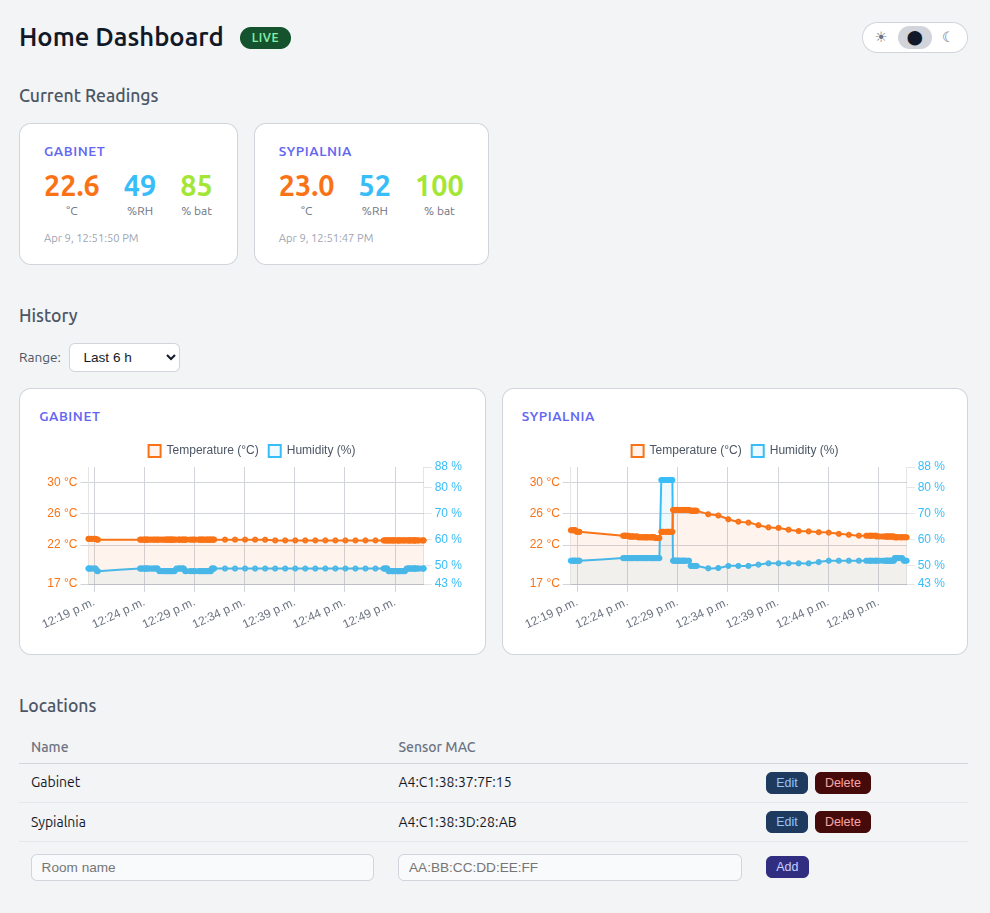

# g2labs-home-dashboard

A local web dashboard for ATC MiThermometer BLE sensor data. Subscribes to MQTT topics published by [blester](https://github.com/g2labs/blester), stores readings in MongoDB, and presents current values and historical plots in a browser.



## Features

- Parses ATC custom advertisement format from blester MQTT payloads
- Group-aware location management — assign sensor MACs to named rooms and groups via the UI
- User context with group-based access control for location readouts
- Historical charts with automatic resolution scaling (`$bucketAuto`) across any time range
- Shared y-axis scales across all location charts with ±5 padding
- Real-time card updates via Socket.io
- Light / dark / system theme toggle, persisted in localStorage

## Requirements

- Node.js 18+
- MongoDB (local or remote)
- An MQTT broker reachable from the machine running this app
- [blester](https://github.com/g2labs/blester) scanning ATC MiThermometer devices and publishing to the `atc` topic

## Setup

```bash
npm install
```

Copy `.env.example` to `.env` and adjust as needed (all values have defaults):

```bash
cp .env.example .env
```

Note: `.env.example` is a sample local-network configuration. If you omit a variable entirely, the application falls back to the runtime defaults listed below.

## Configuration

| Variable | Runtime default | Description |
|---|---|---|
| `APP_MODE` | `production` | Use `test` to run with the mock DB and generated readings |
| `DB_DRIVER` | `mongo` in production, `mock` in test mode | Force database adapter selection |
| `READING_SOURCE` | `mqtt` in production, `generator` in test mode | Force live MQTT or generated readings |
| `MQTT_BROKER` | `mqtt://localhost:1883` | MQTT broker URL |
| `MQTT_TOPIC` | `atc` | Topic to subscribe to (also subscribes to `atc/#`) |
| `MONGODB_URI` | `mongodb://localhost:27017/home-dashboard` | MongoDB connection string |
| `PORT` | `3000` | HTTP port |
| `CHART_BUCKETS` | `300` | Max data points per chart (aggregated by MongoDB) |
| `MOCK_INTERVAL_MS` | `5000` | Reading interval for the mock generator in test mode |

## Running

```bash
# Production
npm start

# Development (auto-restarts on file change)
npm run dev

# Test/demo mode with mock DB + generated readings
APP_MODE=test npm start
```

Then open [http://localhost:3000](http://localhost:3000).

## Test mode

For UI testing or local development without MongoDB and MQTT, run:

```bash
APP_MODE=test npm start
```

In test mode:

- the database dependency is injected as an in-memory mock adapter
- the MQTT dependency is injected as a generated reading source
- the dashboard still uses the same HTTP routes and Socket.io updates as production
- seeded users and groups are available through the header user switcher so access filtering can be exercised without real auth

## UI testing

Playwright smoke tests can run against the injected mock mode, so the browser exercises the real dashboard without external dependencies.

```bash
npm install
npx playwright install
npm run test:ui
```

The Playwright config starts the app automatically with:

```bash
APP_MODE=test PORT=4173 MOCK_INTERVAL_MS=250 npm start
```

Current coverage includes:

- dashboard smoke test for seeded cards and charts
- clock format toggle behavior
- location CRUD flow in the mock DB
- user switching and group-based access filtering
- mobile viewport smoke test

## User and group access

Locations belong to a single group. Users can belong to one or more groups. A user can view current readings, historical charts, and location rows only for locations assigned to one of their groups.

The current implementation uses request and socket user context rather than full login/session auth:

- HTTP requests resolve the current user from the `x-user-id` header when provided
- Socket.io connections resolve the current user from the client auth payload
- if no explicit user is supplied, the default user is used

In test mode, the seeded users are:

- `Grzegorz` as an `admin`, with access to all groups
- `Anna` with access to `Family`

Default Mongo bootstrap behavior:

- if no groups exist, the app creates `Default Home`
- if no users exist, the app creates `Default Admin` with username `admin` and role `admin`
- existing locations without a `groupId` are assigned to `Default Home`

## Data flow

```
ATC MiThermometer (BLE)
        │
      blester
        │ MQTT  topic: atc
        ▼
  g2labs-home-dashboard
        │ saves raw readings
        ▼
     MongoDB
        │ $bucketAuto aggregation
        ▼
   Browser dashboard
```

## MQTT payload

Blester publishes BLE advertisement data as JSON. The dashboard decodes temperature, humidity, and battery from the ATC custom service UUID (`0000181a-0000-1000-8000-00805f9b34fb`):

```json
{
  "address": "AA:BB:CC:DD:EE:FF",
  "name": "ATC_XXXX",
  "rssi": -65,
  "service_data": {
    "0000181a-0000-1000-8000-00805f9b34fb": "aabbccddeeff09c12d6013880a"
  }
}
```

Readings from unassigned MACs are silently dropped. Assign a sensor to a location via the Locations panel in the UI.

## License

MIT
